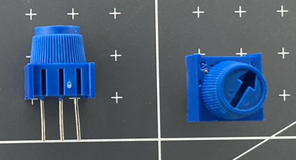
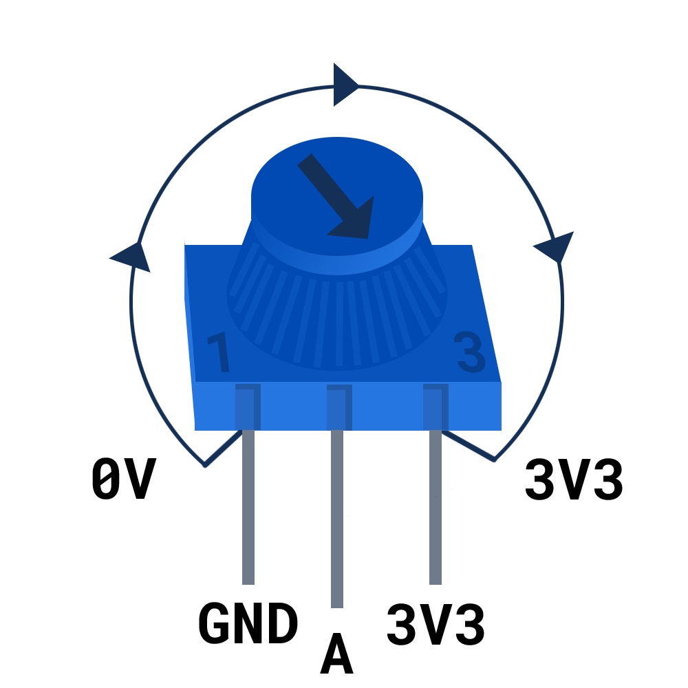

## Potentiometers

A potentiometer is a resistor that allows you to change the value of the resistance. They are often just called **pots**.

A potentiometer has three pins. The outer pins are normally connected to a 3V3 pin and a GND pin. The middle pin is connected to a GPIO pin capable of reading an analogue signal

Turning the dial on the top of the potentiometer will change the resistance of the potentiometer, which can then be read by the Raspberry Pi Pico.

[[[potentiometer-wiring]]] 

The potentiometer 

[[[potentiometer-pin]]]

The following code will read a value from the potentiometer and print out the result.
