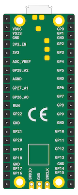

## Meet Raspberry Pi Pico

This is a Raspberry Pi Pico. Hopefully your device has already had the header pins soldered on, but if not, you might like to have a look at our [Getting started with soldering resource](https://projects.raspberrypi.org/en/projects/getting-started-with-soldering).

--- task ---
 
Plug your micro USB cable into the port on the left-hand side of the board.

--- /task ---

If you need to know the pin numbers for a Raspberry Pi Pico, you can refer to the following diagram.

