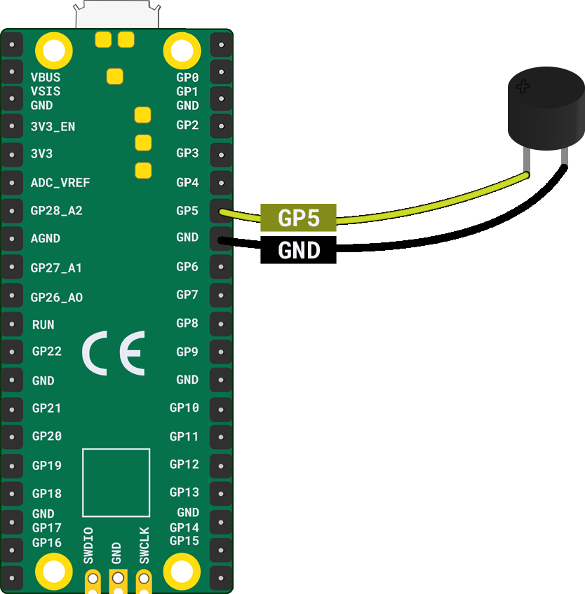

## Passive Buzzers

[[[passive-buzzers]]]

Some passive buzzers can be connected without worrying about which pin is connected to ground, and which pin is connected to a GPIO pin on the Raspberry Pi Pico. Others have to be connected in a specific way and will normally have a **+** symbol on the surface, to tell you which pin needs connecting to the GPIO signal pin

To play a note with the passive buzzer you can use the following code.

--- code ---
---
language: python
filename: main.py
line_numbers: false
line_number_start: 
line_highlights: 
---
from picozero import Speaker

speaker = Speaker(5)

speaker.play(523, 1) # 523 = note C4, for 1 second)
--- /code ---

Change the value of the **note** argument and the **time** it is played for.