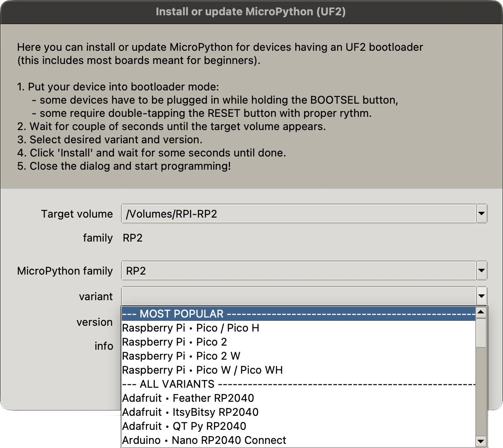

## Add the MicroPython firmware

If you have never used MicroPython on your Raspberry Pi Pico, you will need to add the MicroPython firmware. 

--- task ---

Find the BOOTSEL button on your Raspberry Pi Pico. 

Press the BOOTSEL button and hold it while you connect the other end of the micro USB cable to your computer. A Raspberry Pi is shown in the image below, but the same applies to any computer.

This puts your Raspberry Pi Pico into USB mass storage device mode. 

--- /task ---

--- task ---

In the bottom right-hand corner of the Thonny window, you will see the version of Python that you are currently using. 

Click on the Python version and choose 'MicroPython (Raspberry Pi Pico)':

If you don't see this option, then check that you have plugged in your Raspberry Pi Pico. 

--- /task ---

--- task ---

A dialog box will pop up to install the latest version of the MicroPython firmware on your Raspberry Pi Pico. 

Click the **Install** button to copy the firmware to your Raspberry Pi Pico. 

Wait for the installation to complete and click **Close**.

--- /task ---

--- collapse ---

--- 

title: Firmware installation menu

---

You can also access the firmware installation menu if you click on 'MicroPython (Raspberry Pi Pico)' in the status bar and choose 'Configure interpreter ...'.

The interpreter settings will open.

Click on **Install or update firmware**. 

You will be prompted to plug in your Raspberry Pi Pico while you hold the BOOTSEL button. 

Then you can click **Install**. 

Wait for the installation to complete and click **Close**.

--- /collapse ---

You don't need to update the firmware every time you use your Raspberry Pi Pico. Next time, you can just plug it into your computer without pressing the BOOTSEL button.
