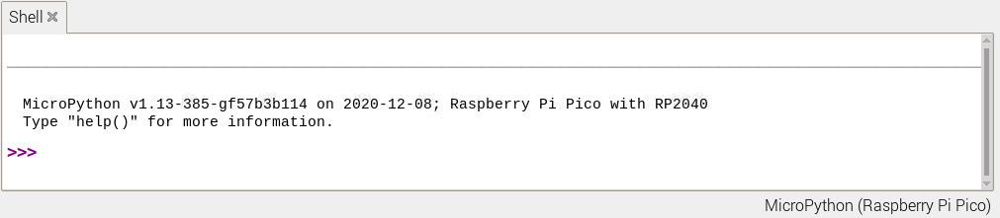

## Use the Shell

In this step, you will use the Thonny Shell to run some simple Python code on your Raspberry Pi Pico.

--- task ---

Make sure that your Raspberry Pi Pico is connected to your computer and you have selected the MicroPython (Raspberry Pi Pico) interpreter.

--- /task ---

--- task ---

Look at the Shell panel at the bottom of the Thonny editor. 

You should see something like this:



Thonny is now able to communicate with your Raspberry Pi Pico using the REPL (read–eval–print loop), which allows you to type Python code into the Shell and see the output. 

--- /task ---

--- task ---

Now you can type commands directly into the Shell and they will run on your Raspberry Pi Pico.

Type the following command.

``` python
print("Hello")
```
Tap the Enter key and you will see the output:


--- /task ---

--- task ---

MicroPython adds hardware-specific modules, such as `machine`, that you can use to program your Raspberry Pi Pico. 

Let's create a `machine.Pin` object to correspond with the onboard LED, which can be accessed using GPIO pin 25. 

If you set the value of the LED to `1`, it turns on. 

Enter the following code, make sure you tap Enter after each line.

``` python
from machine import Pin
led = Pin(25, Pin.OUT)
led.value(1)
```

You should see the onboard LED light up. 


Type the code to set the value to `0` to turn the LED off.

``` python
led.value(0)
```

Turn the LED on and off as many times as you like. 

**Tip:** You can use the up arrow on the keyboard to quickly access previous lines. 

--- /task ---

If you want to write a longer program, then it's best to save it in a file. You'll do this in the next step.

